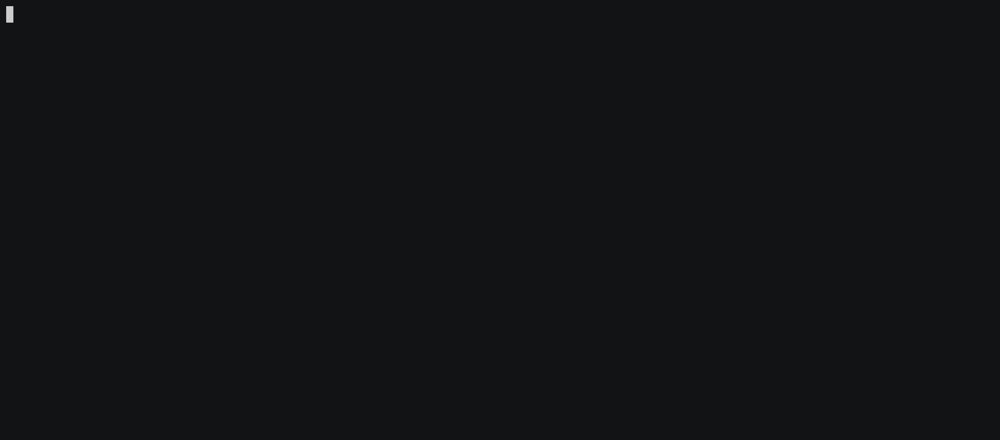

# Docker



## Run Echo-Server

List of available [Docker Tags](https://hub.docker.com/r/ealen/echo-server/tags) - Read the [release notes](https://github.com/Ealenn/Echo-Server/releases)

```sh
docker run -d \
    -p 3000:80 \
    ealen/echo-server
```

You can use environment variables with `-e ENV_NAME=VALUE` or CLI arguments after image's name `ealen/echo-server --arg value`

### Example

- **With environment variables:**

```sh
docker run -d \
    -p 3000:80 \
    -e ENABLE__ENVIRONMENT=false
    ealen/echo-server
```

- **With CLI arguments:**

```sh
docker run -d \
    -p 3000:80 \
    ealen/echo-server --enable:environment false
```



---


